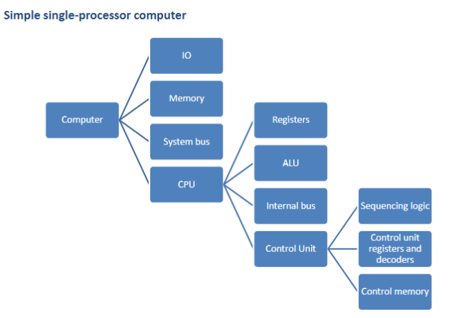

# Organization & architecture
## Definitions
- **Computer architecture**: attributes that affect the how the programmer interacts with the system
	- related with high-level design decisions
- **Computer organization**: physical implementation of architecture design, also known as [Microarchitecture](https://en.wikipedia.org/wiki/Microarchitecture)  
	- related with low-level implementation of *Computer architecture*
> [!EXAMPLE] Computer architecture VS organization
> Architecture: How can the programmer multiply? 
> Organization: How should we implement multiplication?(addition loops? multiplication algorithms?)

## impacts
Design choices in *Computer architecture* and implementation in *Computer organization* impacts the device in the following ways:
- instruction set
- sizes of datatypes
- ways to interact with I/O
- ways to access memory addresses

Design choices are made with consideration of a few things: Need, Speed, Cost, Size, Usage, etc.

## complex system
- computers work in a hierarchy of abstractions
- each abstraction works to simplify the system into a simpler, abstracted form, that is easier to work with
### Structure
The way components are related to each other(dependency structure)
### Function
What each component does(individual components)
#### basic functions
##### 1. Data Processing
- manipulating data by a computer
##### 2. Data Storage
- short term storage
- long term storage
##### 3. Data Movement
- I/O peripheral devices
- data communications - transfer of data through long distances
##### 4. Control
- control unit manages resources, and controls individual parts to work together according to instructions

#### Structure
##### 1. Central Processing Unit (CPU)
- Controls operations and data processing(processor) functions
##### 2. Main memory
- data storage
##### 3. I/O
- Moves data to/fro input/output transducers
##### 4. System interconnection
- provides communication between components(data buses, etc.)
##### Single core computer structure
Single core computers are computers that only contains one processor in one chip
###### Central Processing Unit
Controls operation of computer. (Often called Processor). It contains the following
- Control Unit: controls operation of CPU
- Arithmetic and logic unit (ALU): performs data processing functions
- Registers: internal storage system
- CPU interconnection: allows interaction with above mentioned components
###### Main memory
Stores data
###### I/O
moves data between computer and physical environment
###### System interconnection
allows interaction between components. (e.g. system bus)

##### Multicore computer structure
Multicore computers are computers that has multiple processors in a single chip
> [!INFO] Processing Units
> A processing unit contains a few things, namely
> 1. Control Unit
> 2. Arithmetic and logic unit (ALU)
> 3. Registers
> 4. CPU interconnection

##### refining definitions/terminology
###### Central Processing Unit(CPU)
- fetches and executes instructions. Contains ALU, control unit, and registers.
###### Core
- one processing unit in a chip. A core has all functionality of a CPU in a single-CPU system. We refer to specialized processing units as "cores" too. (e.g. vector/matrix optimized units).
###### Processor
- Chip that contains one ore more Cores. Processor interprets and executes instructions.
- Processors that contain multiple Cores are called multicore processors
# History
In `1936`, Alan Turing came up with the idea of a [Turing machine](https://en.wikipedia.org/wiki/Turing_machine). This conceptual machine can simulate **ANY** computer algorithm, no matter how complex.
## Turing machine
- Infinitely long "tape"(memory)

The tape contains squares. These squares can be written with "`0`", "`1`" and "` `"(3-symbol Turing machine)
The Turing machine has a "head" which can read the square positioned beneath it. It can then perform 3 basic operations.
1. Read - read the value of the square in the tape.
2. Modify - change or clear the value stored on the square of the tape.
3. Move - move left or right one square up or down the tape to read/edit them.
## First generation computers
The first generation of computers utilized vacuum tubes for digital logic and memory.

[EDVAC](https://en.wikipedia.org/wiki/EDVAC)(Electronic Discrete Variable Computer) was designed in `1944`, and was proposed on `1945` by von Neumann. EDVAC is a binary serial computer, with 5.5kb memory capacity.

IAS(Institute for Advanced Study) computer design started at `1946`. IAS was designed to be a new stored-program computer. IAS computer is the prototype for subsequent general-purpose computers.
## Second generation computers
Transition from vacuum tubes to transistors
## Third generation computers
Shift to Integrated circuits. 
> [More components could be packed on the same chip as time goes by.](#Moore's%20law)
## Later generations
Later generations are categorized via advances in integrated circuit tech.
> Large-Scale integration (LSI) contains more than 1,000 components on a single chip. 
> Very-large-scale integration (VLSI) contains more than 10,000 components per chip 
> Ultra-large-scale integration (ULSI) chips contain more than one billion components.

## Consequences of integration
1. **cost** for memory & logic dropping drastically
2. because logic & memory are being placed closer together, the *travel time of electricity is shortened, leading to faster performance*.
3. computers becoming smaller
4. lower power requirements
5. interconnections are more reliable then solder connections. Reduction of interchip connection
## Moore's law
Moore's law is an observation that the number of transistors that can be put in a single chip doubles every year.[^1]

[^1]: Author's note: Moore's law is reaching it's physical hard limit, due to transistors reaching the size of atoms. With this, a slowdown in advancement of chip performance is in the horizon. [MIT tech review](https://www.technologyreview.com/2020/02/24/905789/were-not-prepared-for-the-end-of-moores-law/)

## Intel processor development
- `8080` a 8 bit microprocessor `1974`
- `8086/8088` in `1978`
	- CLK speed: 5MHz
	- No. of Transistors: `29,000`
	- Circuit line width: `1.5` micron
- `80386` in `1985`
	- CLK speed: 16 MHz
	- No. of Transistors: `275,000`
	- Circuit line width: `1.5` micron
- `Pentium` in `1993`
	- CLK speed: 66 MHz
	- No. of Transistors: `3.1 Million`
	- Circuit line width: `0.8` micron
- `Pentium 4` in `2000`
	- init CLK speed: `1.5 GHz`
	- No. of Transistors: `42 Million`
	- Circuit line width: `0.18` micron
- `Pentium-9` in `2022`(12th gen)
	- CLK speed: `5 GHz`
	- Feature size:10nm
	- Processor Cores: 8 P-cores + 8 E-cores
	- Cache memory: 30MB
## Embedded Systems
electronics + software as a product. Non general purpose computers.

## Internet of Things(IOT)
An extension of Embedded Systems, IOT is the interconnection of embedded systems.

## Microcontrollers
Typically used in embedded systems 
contains CPU, ROM, RAM, and I/O. Can be considered as "computer on a chip" 
Consume less energy

## Digital signal processors
Designed for Digital Signal Processing(DSP) algorithms.
- usually used for algorithms that use a large amount of math operations. (e.g. audio/video)
- most DSP algos have time constraints, like FPS in video processing.

# ARM architecture
ARM(Acorn RISC Machine) is a family of RISC-based microprocessor/microcontrollers designed by ARM Holdings. 
3 different Cortex arches, with initials `A`, `R`, and `M`. 
## Cortex-A
Processors intended for **Mobile devices** like smartphones, eBook readers, etc.
## Cortex-R
Real-time applications with **critical timings**, like automotives, mass storage, networking, etc.
## Cortex-M
Processors intended for **Microcontrollers** like IoT, wireless sensors

# Performance issues
## High power computing
- Image processing
- Three-dimensional rendering
- Speech recognition
- Videoconferencing
- Multimedia authoring
- Voice and video annotation of files
- Simulation modelling

## Microprocessor Speed
Processor techniques utilized for faster execution speeds
- Pipelining
- Branch prediction
- Superscalar execution
- Data flow analysis
- Speculative execution
(these will be elaborated more in later chapters)

## Memory Speed
- Due to fast advancements in microprocessors, other components like DRAM(Dynamic Random Access Memory) aren't able to keep up.
- While Microprocessors increase in speed, DRAM increased in capacity.
- Improvements - Microprocessors: 60% increase/year
- Improvements - DRAM: 10% increase/year
	
RAM ICs contain transistor + capacitors
- RAM works in CLK cycles, to read/write data.
- Column Access Strobe(CAS) latency or CL is the time taken from receiving a command to executing it. The number indicates the amount of CLK cycles it takes.
## Multicore and GPU
- Multiple processors are placed in one chip to improve performance.
- Increases performance without increasing CLK rate.
- GPUs are designed to work in parallel. I.e. processing graphics data
- GPUs are designed for repetitive computations

We are no longer able to increase CLK rates, due to the physical limit of speed that is faced by the semiconductor. Hence, via utilizing multiple processors in parallel, we are able to improve computing performance.
## TPU(Tensor Processing Unit)
TPUs are an example of hardware tailored for a certain use case. 
TPU is made for machine learning applications by Google, for TensorFlow software.

## Limitations of Multiprocessors
Design changes that helped improve Microprocessors
- parallel processors
- memory cache hierarchy
- faster memory accesses timings and I/O transfer rates
### Amdahl’s law
Formula: $$S(N) = \frac{1}{\left((1-P)+\left(\frac{P}{N}\right)\right)}$$ Where function $S$ = maximum speedup, $N$ = amount of processors used, and $P$ = proportion of a system/program that can be made parallel.

As $N$ grows, the speedup tends to be: $\frac{1}{1-P}$
