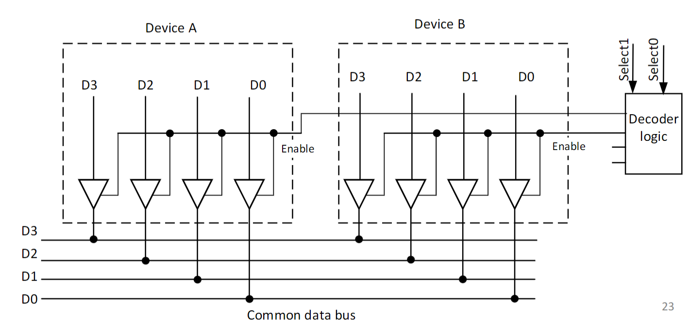

Recap time!
# Boolean logic + Logic Gates
- Logic gates are the basics of IC chips
- made from transistors
- basic gates: `AND`, `OR`, `NOT`
- Small-Scale Integration(SSI): <10 Gates
- Medium-Scale Integration(MSI): 10-100 Gates
- Large-Scale Integration(LSI): 100-1000 Gates
- Very-Large-Scale Integration(VLSI): >1000 Gates

## Logic Gates

### NOT
Denoted by `!`, `'`.

| X | Z |
|---|---|
| 0 | 1 |
| 1 | 0 |
### AND
Denoted by `*`, `.`.

| X | Y | Z |
|---|---|---|
| 0 | 0 | 0 |
| 0 | 1 | 0 |
| 1 | 0 | 0 |
| 1 | 1 | 1 |

### OR
Denoted by `+`.

| X | Y | Z |
|---|---|---|
| 0 | 0 | 0 |
| 0 | 1 | 1 |
| 1 | 0 | 1 |
| 1 | 1 | 1 |

### XOR
Denoted by `^`(or $\oplus$).

| X | Y | Z |
|---|---|---|
| 0 | 0 | 0 |
| 0 | 1 | 1 |
| 1 | 0 | 1 |
| 1 | 1 | 0 |

### 3 state device
| Control | Input | Output |
|---|---|---|
| 1 | 0 | 0 |
| 1 | 1 | 1 |
| 0 | 0 | open circuit|
| 0 | 1 | open circuit|

## Boolean Algebra and Theorems
- Commutative Law: `X+Y = Y+X`
- Distributive Theorem: `X(Y+Z) = XY+XZ`
- De Morgan’s Theorem I: `(X+Y)’ = X’Y’`
- De Morgan’s Theorem II: `(XY)’ = X’+Y’`
- Associative Law: `X(YZ) = (XY)Z`, `X+(Y+Z) = (X+Y)+Z`
### Karnaugh Maps
- Useful for simplifying functions without using theorems
Tips for K-maps
1. Loop the largest `2^{n}` values first
2. Values can be looped multiple times over. No `1` should not be looped.
3. All edges are connected.

## Logic
### Combinational Logic
- Digital I/O that performs a certain function
- Depends on current values(Doesn't remember state\[no memory\])
#### Design
- Define I/O
- Create Truth Table
- Use K-map
- Implement logic
#### Adder
##### Half-adder
| In | In | Out | Out |
|---|---|---|---|
| A | B | Sum | Carry |
| 0 | 0 | 0 | 0 |
| 0 | 1 | 1 | 0 |
| 1 | 0 | 1 | 0 |
| 1 | 1 | 1 | 1 |

sum = $A \oplus B$  
carry = $A \cdot B$  

##### Full-adder
| In | In | In | Out | Out |
|---|---|---|---|---|
| A | B |Cin|Sum|Cout|
| 0 | 0 | 0 | 0 | 0 |
| 0 | 0 | 1 | 1 | 0 |
| 0 | 1 | 0 | 1 | 0 |
| 0 | 1 | 1 | 0 | 1 |
| 1 | 0 | 0 | 1 | 0 |
| 1 | 0 | 1 | 0 | 1 |
| 1 | 1 | 0 | 0 | 1 |
| 1 | 1 | 1 | 1 | 1 |

Sum = Cin $\oplus$(A$\oplus$B)  
Cout = AB + Cin(A$\oplus$B)  
We can stack full-adders to create a n-bit adder
#### Decoder
- Decoders are combinational circuits.
- Converts binary input to unique output line.
- One output active at any given time.

1-to-2 line decoder

| I0 | O0 | O1 |
|----|----|----|
| 0 | 1 | 0 |
| 1 | 0 | 1 |

2-to-4 line decoder

| I0 | I1 | O0 | O1 | O2 | O3 |
|----|----|----|----|----|----|
| 0 | 0 | 1 | 0 | 0 | 0 |
| 0 | 1 | 0 | 1 | 0 | 0 |
| 1 | 0 | 0 | 0 | 1 | 0 |
| 1 | 1 | 0 | 0 | 0 | 1 |
- We can add an "enable" using AND gates
#### Encoder
- Opposite of [Decoders](#Decoder).
- Converts unique input lines to binary output.

4-to-2 line encoder

| I3 | I2 | I1 | I0 | O1 | O0 |
|----|----|----|----|----|----|
| 0 | 0 | 0 | 1 | 0 | 0 |
| 0 | 0 | 1 | 0 | 0 | 1 |
| 0 | 1 | 0 | 0 | 1 | 0 |
| 1 | 0 | 0 | 0 | 1 | 1 |

#### Multiplexer(MUX)/Demultiplexer(DEMUX)
- Multiplexer has n-inputs, with one output, as well as select lines.
- Demultiplexer has one input, with n-inputs, as well as select lines.
- you can combine multiplexers to create larger n-1 multiplexers

#### Tri-state buffer
- Input controlled with enable

#### Data Bus Access Control
A common data bus contains the following
1. Decoder logic
2. Tri-state buffers(each tri-state buffer is in charge of handling a device)

### Sequential Logic
- Remembers state(has memory)
#### S-R latch
When `S` and `R` are `1`, the outputs of `Q` and `!Q` remain the same(in a NAND gate S-R, no-change state in NOR gates are `S`,`R` -> `0`).
- Basic logic circuit for flip-flops(D, J-K, etc).
#### D latch
- Adding 2 NAND gates to the inputs, `S` and `R`(one each), as well as an inverter on one input ensures the D latch is always in a correct state, as compared to [S-R latches](#S-R%20latch)(NAND GATE).
##### Gated D-latches
- `Q` = `S` when Write Enable(WE) == `1`
- Used to design Static RAM(SRAM) and registers.
- WE can be connected to multiple Gated D-latches which allows simultaneous writes

## Memory
- Read/Write able
- Indexed with unique address
- Addressability: Amount of bits that can be stored in a single address[^1]
- Address space: Total amount of locations that can be addressed in a system
- Reading from memory
	1. Address decoder
	2. multiplexer
- Writing from memory uses similar concepts

[^1]: In most general-use systems, the amount of bits will be `8`, or enough to store a `char`.

### How are Logic Gates made?
- Computers use CMOS(Complementary MOS), that uses both n and p-type transistors.[^2]

[^2]: Fun fact! did you know that Bipolar junction transistors(BJTs) can also be used to create logic gates?
