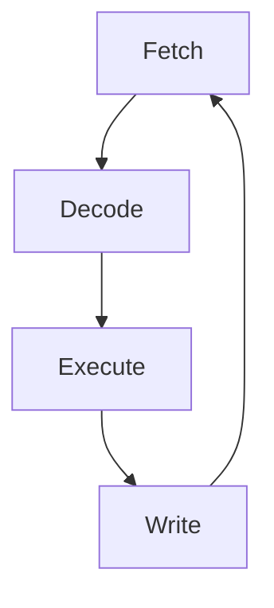

# Basic Computer Architecture
A processor system contains of 3 main parts
1. I/O interface circuit
- Mouse
- Keyboard
- Screen
- USB
- etc
2. Central Processing Unit
- I7
- Pentium
- 8086
- etc
3. Memory
- DRAM
- SRAM
- RAM
- ROM
- etc
## Central Processing Unit(CPU)
- Contains system operations
- Performs arithmetic and logic operations
Contains
- Registers
- Control Unit
- ALU(Arithmetic Logic Unit)
### Arithmetic Logic Unit(ALU)
- Implements mathematical operations `+`, `-`, `*`, `/`.
- Implements logic `&`(AND), `|`(OR), `!`/`~`(NOT), `^`(XOR).
- shifts and rotates are also implemented in ALU.

### Registers
- Temp storage for values used by ALU
- Quick access times by CPU

### Control Unit(CU)
- Decodes instructions
- Controls I/O, CPU, and data flow

## Buses
- Connects different components in a computer system together
Contains
- Address Bus
- Data Bus
- Control Bus

### Address Bus
- Unidirectional(one way).
- Accesses selected memory location

Capacity of an address bus is calculated as follows:  
**`2^{N}` where `N` -> Number of address lines**

### Data Bus
- Bidirectional(two way).
- Transfers information between CPU and memory.
- Sizes include `8`, `16`, `32`, or `64` bits.
- Larger buses mean more information can be transferred at one time

### Control Bus
- Sends signals from the processor to different components
- Common lines:
	1. READ(RD): when active, data is being READ by CPU
	2. WRITE(WR): when active, data is being WRITTEN by CPU
	3. BYTE ENABLE(E): Lines that indicate the size of the data(8, 16, 32, 64 bytes)
- Other lines are dependent on the processor, but some include ACK(Transfer Acknowledgement), IRQ(Interrupt Request), and Reset, to name a few.

## Fetch-Decode-Execute cycle
When running code, there's a few things that has to be done.

NOTE: This part deviates from the route of the notes a bit, but bear with me. I find that this is an important concept to grasp, especially for later topics covered.

### 1. Fetch
First, we need to fetch a instruction to perform operations on.

### 2. Decode
Next, We need to decode the instruction.
- What's it's opcodes?
- What are it's parameters?
- How should the instruction be handled?(ALU? READ/WRITE?)

### 3. Execute
Now, we can run the instruction.

### 4. Write result
We can then write the result of the instruction into the appropriate registers, or addresses.

### Extra info
- In some CPUs, there might be 2 fetch cycles. One for opcodes, and another to fetch operands for the specified opcode.
- Not all instructions execute with the same amount of time! We measure it with "clock cycles". Which indicates **approximately** the amount of clocks an instruction might take. Some instructions take a longer time then others[^1].

  

[^1]: Usually, these instructions either (1): Deal with multiple operations in one go, or (2): are accessing other hardware(e.g. RAM/cache), which can have higher read times associated with it.

# 8086 Architecture
8086 is split into 2 functional units, namely [Execution Unit(EU)](#Execution%20Unit%28EU%29), and [Bus Interface Unit(BIU)](#Bus%20Interface%20Unit%28BIU%29).

## Bus Interface Unit(BIU)
- Transfers data, addresses, and instructions to EU.
- Transfers data between I/O, processors, and external memory.
- Calculates effective address
- Instruction Queue - stores 6 bytes of next instruction. Increases speed due to reduced delays in [Fetch-Decode-Execute](#Fetch-Decode-Execute%20cycle) cycles.
- Simultaneous operation of BIU and EU is possible when the EU doesn't need the system bus.(In 8086, EU is not connected to the system bus)

(not really touched in notes, but nice to know I guess?)
- Segment Registers
	- `CS`: Code segment - points to memory location of code segment in memory
	- `DS`: Data segment - points to data that the program uses, holds offset address
	- `SS`: Stack segment - points to memory location that stores data
	- `ES`: Extra segment - holds additional destination data
- Instruction Pointer - points to next instruction

## Execution Unit(EU)
- EU tells BIU where to fetch instructions
- [Fetch-Decode-Execute!](#Fetch-Decode-Execute%20cycle)

# Memory
<!-- if my memory serves me right, at least..! -->
- Stores data
- Primary memory
	- Read Only Memory(ROM)
	- Random Access Memory(RAM)
	- etc.
- Secondary memory
	- Hard disk
	- Thumb drive
	- etc.
## Memory types
### Non-Volatile memory
- ROM - cannot be programmed
- Erasable Programmable Read Only Memory(EPROM) - can be reprogrammed
- Flash memory - can be reprogrammed
### Read/Write memory
- RAM - volatile; lose memory when powered off
- SRAM(static RAM); uses CMOS, behaves like latches, flip-flops. Synchronous in nature
	- static
	- faster
	- lower capacity(higher cost)
	- 6 D-latches per cell
	- Address and data must be stable to start/finish a write.
- DRAM(Dynamic RAM); stored in capacitors, as a result, lasts only a short period of time. Needs constant refreshing via read/writes
	- dynamic
	- slower
	- higher capacity(lower cost)
	- one transistor per bit(cheaper)

## Memory addressing
- fixed length numbers(same amount of bits for addressing)
## Memory Write Cycles
- It takes around 4 clock cycles to read/write. 
### Writing
Cycles
1. stabilize address
2. stabilize data; write starts
3. write data
4. Write ends; release address, data.

### Reading
Cycles
1. stabilize address
2. read starts
3. stabilize data
4. read ends; data is read. release address, data.

 Attentive readers will notice the examples are curious, and not immediately understandable. These are assembly instructions. Specifically, this is a `MOV` instruction.[^bignote] 

[^bignote]: Assembly can be considered as one level above machine code, that is fetched and decoded in the [fetch-decode-execute cycle](#Fetch-Decode-Execute%20cycle). We will cover the assembly language in later topics. However, for the curious, `MOV` as the mnemonic suggests is a MOVe instruction. In architectures(like in `8086`), usage is specified as such: `MOV DEST, SRC` this is like we are assigning using the `=` operand. i.e. **DEST = SRC** becoming **MOV DEST, SRC**.

	For the Write example, we are given the assembly snippet, `MOV [1000h], AL`(simplified because the value is unimportant). Lets break it down. The two operands of the MOV instruction are `[1000h]`, and `AL`. Lets start with `[1000h]`. Firstly, it's important to note that `1000h` is a hex value. The 1000h is a memory address, which points to a certain area in memory, addressed 1000h. Then, 1000h is being dereferenced with the brackets(i.e. MOV will write `AL` to the value STORED at `1000h`. **You can kinda think of brackets as a pointer in C/C++ equivalent terms.**). Next the second operand, `AL`. AL, is part of a general register, and is 8-bits long.
 
	For the read example, the assembly snippet is flipped. `MOV AL, [1000h]`. This simply reads the value stored at the memory address `1000h`,  and stores it into `AL`. AL is actually part of a bigger general register, `AX`. AX being 16-bits wide. AL accesses the LOW part of AX, while `AH` accesses the HIGH parts of AX, with AL and AH being 8-bits.

### Memory Connection
<!-- todo idk -->

### Basic Memory Connection
<!-- todo idk -->

### Memory decoding

## I/O Interfacing
- Memory mapped I/O
	- I/O devices and memory components are accessed in the same way
	- Simplifies coding + testing
	- Specific memory addresses mapped to specific physical locations
- Port mapped I/O
	- Special I/O commands needed to access memory. E.g. IN and OUT commands

This notes are based on SP's module:  
Author: [<code>@duckupus</code>](https://github.com/duckupus)