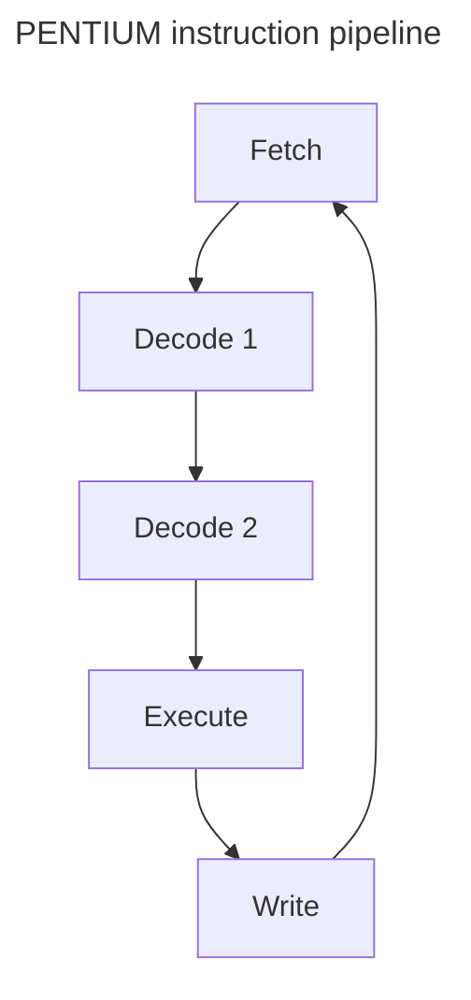

# Pentium
Intel Pentium is an Intel x86 compatible microprocessor. Original Pentium was released in 1993.

## 8088 Processor
8-bit CPU with 1MB memory space.
## 80386 Processor
Introduced 1985.
- CLK speed: 16MHz
- Transistors: 275,000
- Circuit line width(len of lines?): 1.5 micron
- Memory: 6GB(32 bits address)
- Data bus: 32bits
- NO cache
- NO FPU

### 32-bits extension
#### Registers
With the advent of 32-bits, 16-bit registers need to be extended. For example, AX becomes EAX, BX becomes EBX, etc.

Hence, 80386 has a 32-bit address bus too.

#### Memory Interface
The 32-bit memory is partitioned into 4 different "banks", that are referenced: $\overline{\text{BE0}}$ to $\overline{\text{BE3}}$ (Bank Enable). This allows each byte to access a different bank individually.

> [!NOTE]
> <h3>Example</h3>
> 
> `MOV AL, [40h]` is a 1 byte operation.  
> $\overline{\text{BE3}}$ = 1, $\overline{\text{BE2}}$ = 1, $\overline{\text{BE1}}$ = 1, $\overline{\text{BE0}}$ = 0
> 
> `MOV AX, [40h]` is a 2 byte operation.  
> $\overline{\text{BE3}}$ = 1, $\overline{\text{BE2}}$ = 1, $\overline{\text{BE1}}$ = 0, $\overline{\text{BE0}}$ = 0
> 
> `MOV EAX, [40h]` is a 4 byte operation.  
> $\overline{\text{BE3}}$ = 0, $\overline{\text{BE2}}$ = 0, $\overline{\text{BE1}}$ = 0, $\overline{\text{BE0}}$ = 0
> 
> Individual bytes can also be selected.  
> `MOV AL, [41h]` is a 1 byte operation.  
> $\overline{\text{BE3}}$ = 1, $\overline{\text{BE2}}$ = 1, $\overline{\text{BE1}}$ = 0, $\overline{\text{BE0}}$ = 1

## PENTIUM Processor
Introduced 1993.
- CLK speed: 66MHz
- Transistors: 3.1 million
- Circuit line width: 0.8 micron
- **Data bus: 64bits**
- Memory: 8 banks
- Registers: 32bits.
- Execution Units: 32bits.
- Cache: 8kb data, 8kb instruction caches
- Contains both FPU and two ALUs
- FPU: 8-stage pipeline.

<!--TODO: add params for ease of reference? -->
> **Instructions for floating point operations** \
> `FADD` - Add floating point numbers \
> `FMUL` - Multiply floating point numbers \
> `FDIV` - Divide floating point numbers \
> `FSQRT` - find square root of floating point number \
> `FSIN` - Sine operation \
> `FYL2X` - computes $y\times\log_{2}{x}$

Authors note: Performing floating point operations is computationally expensive, and hence takes a long time. Hence, if possible, we will usually try to use integers.

### Optimizations present
- Cache memory

Cache memory is a small(but fast) storage space in the CPU that improves computer performance(by reducing slower accesses into memory).

In PENTIUM, there are two such caches. One for data, and one for instructions, 8kb big each. Benefits include simultaneously accessing the cache for both data + instructions, easier designing + safety for instruction cache due to it being read-only, and speeds up data intensive programs.
- Superscalar(2 processors)

Superscalar utilizes multiple execution units(EU) to processes multiple instructions in parallel. Most modern CPUs are superscalar with varying EUs.

PENTIUM has 3 such EUs. One for floating points, and two for integers. This makes it possible to execute 3 different instructions in one clock cycle.(If requirements are met)

- Pipelining

Pipelining in hardware is an optimization that, in optimal cases, will execute one instruction per EU in every clock cycle. Recall the fetch-decode-execute cycle. While an instruction is being executed, another can be decoded, and yet another can be being fetched. This ensures the pipeline is always full, and always ready to execute a new instruction every clock.

PENTIUM has a slightly different pipeline, with two decoding operations needed(due to a large number of addressing modes). And hence has a 5-stage execution cycle.

- Branch Prediction

With pipelining, we can now execute instructions before evaluating them. While this works for basic blocks of code, the issue comes when we have a branch or conditional jump instruction. Without evaluation, it is impossible to know which route it'll take.

In order to keep the benefits of pipelining and prevent idling, a [branch predictor](https://en.wikipedia.org/wiki/Branch_predictor) is used. This digital circuit will attempt to guess which branch will be taken based on current conditions and past data, and pre-load the instructions accordingly. Hence, if the branch is taken, execution continues per normal. Otherwise, a "stall" happens. Discarding the data and restarting the process up till the branch instruction.

Authors note: While in PENTIUM, this will result in 3 cycles being missed, in more modern CPUs with long pipelines, a misprediction can lead to 10-20 clock cycles being missed!

## PENTIUM 4 Processor
Introduced: 2000.
- Initial clock speed: 1.5 GHz
- Transistors: 42 million
- Circuit line width: 0.18 micron
- Hyper-pipelined (Pipelining but 20 stages)
- Faster ALU(x2 faster then CPU clock speed)
- Execution Trace Cache(part of L2) - after decoding to micro-ops, instructions are stored here. Useful for fetching multiple basic blocks without worrying about execution flow.
- Hyperthreading(run two threads of code at the same time, allowing multithreading)

## Itanium 2 Processor
Introduced: 2002. \
Use case: Servers.
- Initial clock speed: 1 GHz
- Transistors: 220 million
- Circuit line width: 0.18 micron
- arch: IA-64
- 128 general integer registers
- Features
	- Implements predication, speculation, and branch prediction.
	- The same mechanism is also used to permit parallel execution of loops.

## Intel Core Duo
Introduced: 5 Jan, 2006
- Clock speed: 1.66-2.33GHz
- Transistors: 151 million
- L1 Cache: 32k data, 32k instructions
- L2 Cache: 2MB
- This CPU contains 2 cores.
## Trends
- Slow clock speed improvements due to physical limitations
- Optimization of single core performance difficult
- Each newer generation produced with more cores
- Processing is done in memory